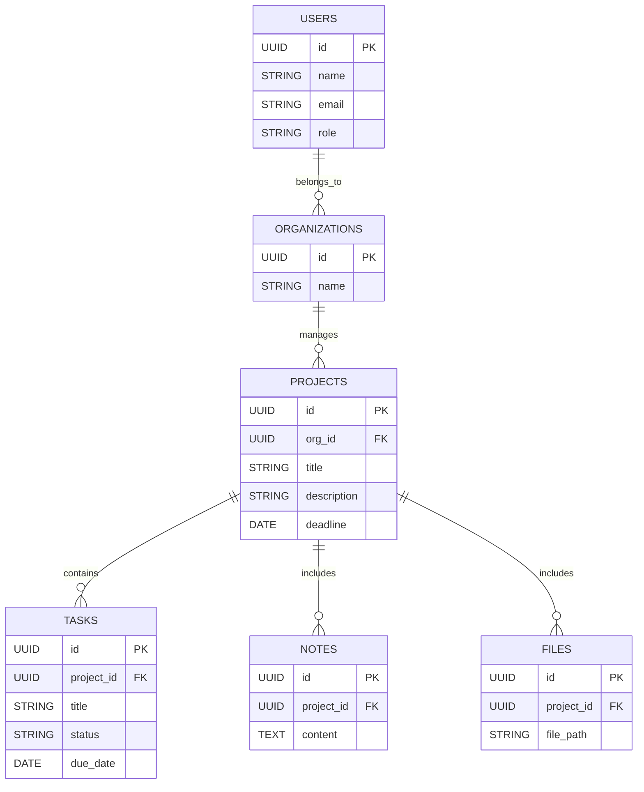

# ER Diagram

```mermaid
erDiagram

    USERS {
        UUID id PK
        STRING name
        STRING email
        STRING role
    }

    ORGANIZATIONS {
        UUID id PK
        STRING name
    }

    PROJECTS {
        UUID id PK
        UUID org_id FK
        STRING title
        STRING description
        DATE deadline
    }

    TASKS {
        UUID id PK
        UUID project_id FK
        STRING title
        STRING status
        DATE due_date
    }

    NOTES {
        UUID id PK
        UUID project_id FK
        TEXT content
    }

    FILES {
        UUID id PK
        UUID project_id FK
        STRING file_path
    }

    USERS ||--o{ ORGANIZATIONS : belongs_to
    ORGANIZATIONS ||--o{ PROJECTS : manages
    PROJECTS ||--o{ TASKS : contains
    PROJECTS ||--o{ NOTES : includes
    PROJECTS ||--o{ FILES : includes
```
