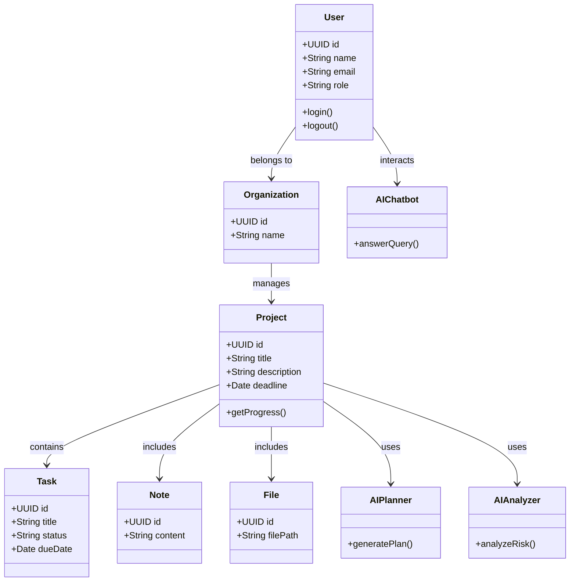

# Class Diagram

```mermaid
classDiagram

class User {
    +UUID id
    +String name
    +String email
    +String role
    +login()
    +logout()
}

class Organization {
    +UUID id
    +String name
}

class Project {
    +UUID id
    +String title
    +String description
    +Date deadline
    +getProgress()
}

class Task {
    +UUID id
    +String title
    +String status
    +Date dueDate
}

class Note {
    +UUID id
    +String content
}

class File {
    +UUID id
    +String filePath
}

class AIPlanner {
    +generatePlan()
}

class AIAnalyzer {
    +analyzeRisk()
}

class AIChatbot {
    +answerQuery()
}

User --> Organization : belongs to
Organization --> Project : manages
Project --> Task : contains
Project --> Note : includes
Project --> File : includes
Project --> AIPlanner : uses
Project --> AIAnalyzer : uses
User --> AIChatbot : interacts
```
