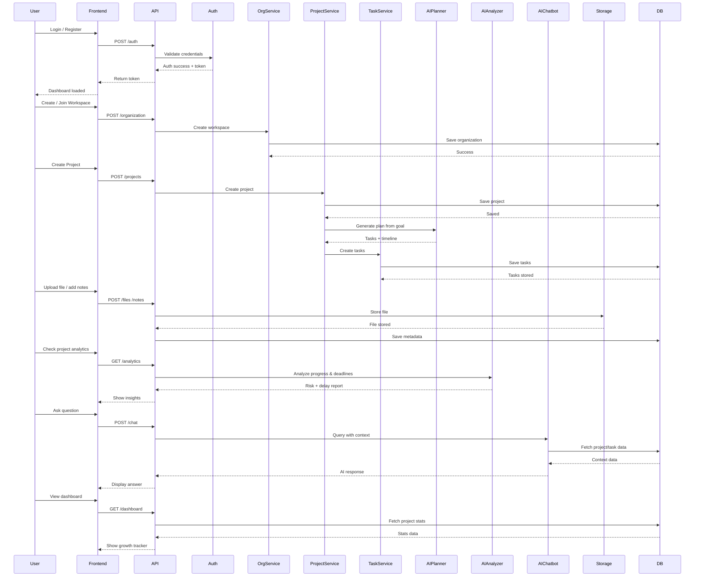

# Sequence Diagram

```mermaid
sequenceDiagram
    participant User
    participant Frontend
    participant API
    participant Auth
    participant OrgService
    participant ProjectService
    participant TaskService
    participant AIPlanner
    participant AIAnalyzer
    participant AIChatbot
    participant Storage
    participant DB

    %% User Login
    User->>Frontend: Login / Register
    Frontend->>API: POST /auth
    API->>Auth: Validate credentials
    Auth-->>API: Auth success + token
    API-->>Frontend: Return token
    Frontend-->>User: Dashboard loaded

    %% Organization / Workspace
    User->>Frontend: Create / Join Workspace
    Frontend->>API: POST /organization
    API->>OrgService: Create workspace
    OrgService->>DB: Save organization
    DB-->>OrgService: Success

    %% Create Project
    User->>Frontend: Create Project
    Frontend->>API: POST /projects
    API->>ProjectService: Create project
    ProjectService->>DB: Save project
    DB-->>ProjectService: Saved

    %% AI Smart Planner
    ProjectService->>AIPlanner: Generate plan from goal
    AIPlanner-->>ProjectService: Tasks + timeline

    %% Task Management
    ProjectService->>TaskService: Create tasks
    TaskService->>DB: Save tasks
    DB-->>TaskService: Tasks stored

    %% File / Notes Upload
    User->>Frontend: Upload file / add notes
    Frontend->>API: POST /files /notes
    API->>Storage: Store file
    Storage-->>API: File stored
    API->>DB: Save metadata

    %% AI Risk & Progress Analyzer
    User->>Frontend: Check project analytics
    Frontend->>API: GET /analytics
    API->>AIAnalyzer: Analyze progress & deadlines
    AIAnalyzer-->>API: Risk + delay report
    API-->>Frontend: Show insights

    %% AI RAG Chatbot
    User->>Frontend: Ask question
    Frontend->>API: POST /chat
    API->>AIChatbot: Query with context
    AIChatbot->>DB: Fetch project/task data
    DB-->>AIChatbot: Context data
    AIChatbot-->>API: AI response
    API-->>Frontend: Display answer

    %% Dashboard / Growth Tracker
    User->>Frontend: View dashboard
    Frontend->>API: GET /dashboard
    API->>DB: Fetch project stats
    DB-->>API: Stats data
    API-->>Frontend: Show growth tracker
```
