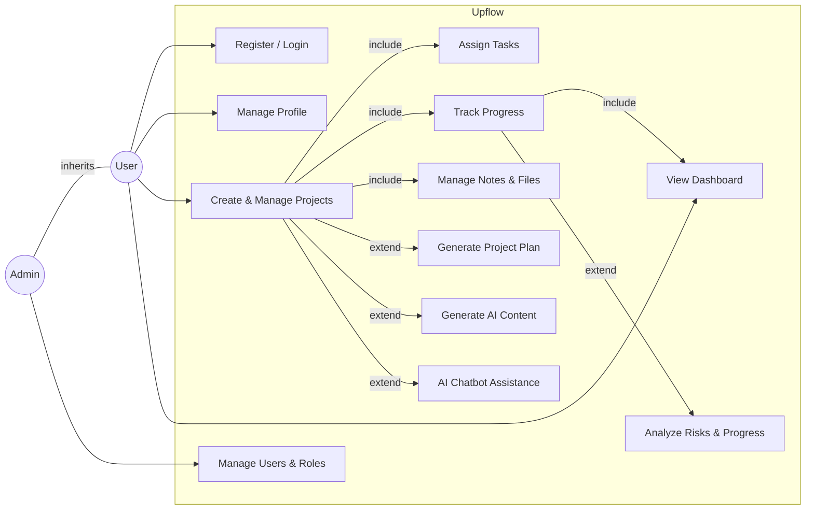

# Use Case Diagram

```mermaid
flowchart LR

    User((User))
    Admin((Admin))

    Admin ---|inherits| User

    subgraph System["Upflow"]

        UC1[Register / Login]

        UC2[Manage Profile]
        UC3[Create & Manage Projects]
        UC4[Assign Tasks]
        UC5[Track Progress]
        UC6[Manage Notes & Files]
        UC7[View Dashboard]
        
        UC8[Generate Project Plan]
        UC9[Analyze Risks & Progress]
        UC10[AI Chatbot Assistance]
        UC11[Generate AI Content]

        UC12[Manage Users & Roles]

        %% Relationships
        UC3 -->|include| UC4
        UC3 -->|include| UC5
        UC3 -->|include| UC6

        UC5 -->|include| UC7

        UC3 -->|extend| UC8
        UC5 -->|extend| UC9
        UC3 -->|extend| UC11
        UC3 -->|extend| UC10

    end

    %% Actor connections
    User --> UC1
    User --> UC2
    User --> UC3
    User --> UC7

    Admin --> UC12
```
